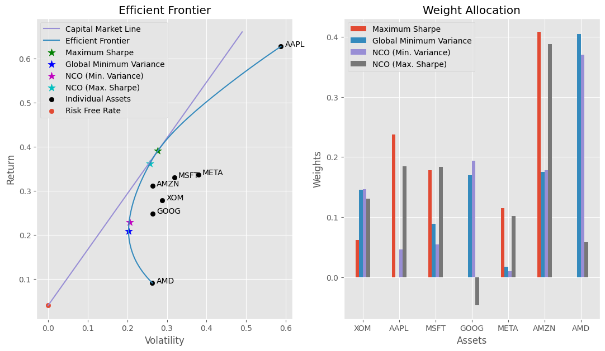
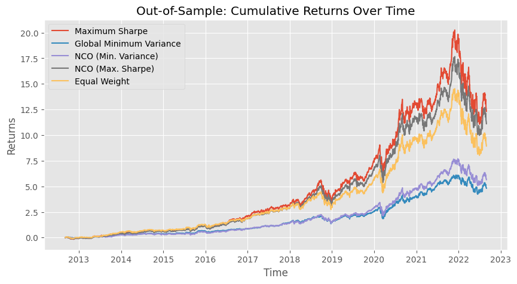

# Portfolio Optimization using Nested Clustered Optimization Algorithm
The goal of this project is to use Nested Clustered Optimization algorithm for the portfolio allocation task, and compare the results against allocations obtained from mean-variance optimization using Sharpe ration and minimum variance.

# Results
## Efficient frontier and weight allocations:

## In-sample test with weight allocations:

## Out-of-sample test with weight allocations:

